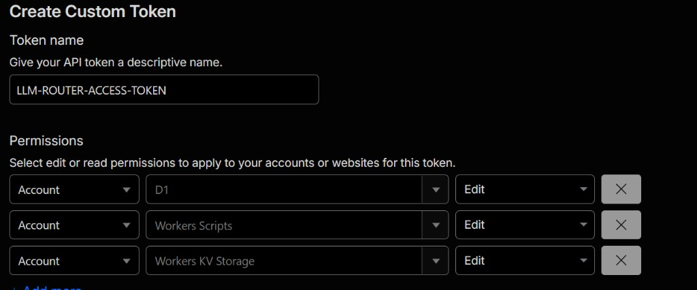
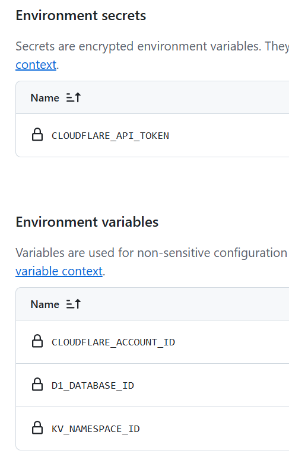

# LLM Router

OpenAI-compatible LLM router for Cloudflare Workers. It lets your apps call one endpoint with a generated router key while the Worker tries your configured provider sequence, rotates provider keys, cools down failing or rate-limited keys, and logs usage.

## Features

- OpenAI-compatible `POST /v1/chat/completions` and `GET /v1/models`
- Streaming response pass-through
- Provider fallback by virtual model route, for example `default`, `fast`, or `smart`
- Adaptive fallback ordering based on recent provider health
- Multiple API keys per provider with basic rotation
- KV cooldowns for rate-limited or failing provider keys
- Per-client-key RPM and daily token quotas enforced at the edge
- D1-backed admin UI for providers, keys, routes, client keys, and usage
- Provider API keys encrypted in D1 using `ENCRYPTION_KEY`
- Client app keys stored only as SHA-256 hashes

## Local Setup

Install dependencies:

```powershell
npm install
```

Create local secrets in `.dev.vars`:

```dotenv
ADMIN_TOKEN=sk-admin-change-me
ENCRYPTION_KEY=use-a-long-random-string-here
```

Apply local D1 migrations:

```powershell
npm run db:migrate:local
```

Build the UI and typecheck:

```powershell
npm run build
```

Run locally:

```powershell
npm run build
npx wrangler dev
```

Open the local Worker URL and enter `ADMIN_TOKEN` in the admin UI. The token is stored in **session storage** for the current browser tab only (it is cleared when you close the tab).

## Deploy to Cloudflare

This section walks through deploying from scratch: Cloudflare account, creating the resources the Worker needs, then running the deploy commands.

### What you'll need

- [Node.js](https://nodejs.org/) 18 or later
- A Cloudflare account (the free tier is enough to get started)
- Git (optional, if cloning the repo)
- A terminal — commands below use PowerShell; equivalent bash notes are included where syntax differs

### Step 1: Create a Cloudflare account

1. Go to [https://dash.cloudflare.com/sign-up](https://dash.cloudflare.com/sign-up).
2. Enter your email and password, then verify your email address.
3. After sign-in you land on the Cloudflare dashboard. You do **not** need to add a website or change nameservers for this project — Workers runs on Cloudflare's `workers.dev` subdomain by default.

No other dashboard setup is required before deploy. Wrangler creates the Worker, D1 database, and KV namespace from your terminal. You can confirm resources later under **Workers & Pages** in the sidebar.

### Step 2: Clone the repo and install dependencies

```powershell
git clone https://github.com/ChandreshRao/llm-router.git
cd llm-router
npm install
```

If you already have the repo locally, `cd` into it and run `npm install`.

### Step 3: Log in to Cloudflare from Wrangler

Wrangler is the Cloudflare CLI (included as a dev dependency). Log in once per machine:

```powershell
npx wrangler login
```

This opens a browser window. Choose your Cloudflare account and approve access. When it succeeds, the terminal prints a confirmation.

To confirm you are logged in:

```powershell
npx wrangler whoami
```

You should see your account email and account ID.

### Step 4: Create a D1 database

D1 stores providers, routes, client keys, and usage logs.

```powershell
npx wrangler d1 create llm-router
```

Wrangler prints JSON like:

```json
{
  "d1_databases": [
    {
      "binding": "DB",
      "database_name": "llm-router",
      "database_id": "xxxxxxxx-xxxx-xxxx-xxxx-xxxxxxxxxxxx"
    }
  ]
}
```

Copy the `database_id` value — you need it in the next step.

You can also find this later in the dashboard: **Storage & databases → D1 SQL Database → llm-router**.

### Step 5: Create a KV namespace

KV stores provider-key cooldowns and client-key quota counters.

```powershell
npx wrangler kv namespace create COOLDOWNS
```

Wrangler prints JSON like:

```json
{
  "id": "yyyyyyyyyyyyyyyyyyyyyyyyyyyyyyyy",
  "title": "COOLDOWNS"
}
```

Copy the `id` value.

You can also find this later in the dashboard: **Storage & databases → Workers KV → COOLDOWNS**.

### Step 6: Configure GitHub for CI deploy (recommended)

`wrangler.jsonc` in the repo uses placeholder IDs so forks do not point at your Cloudflare resources. For deploys from GitHub Actions, add these in the **`dev` environment** (**Settings → Environments → dev**). You can create additional environments in GitHub (for example `staging` or `production`) with their own secrets and variables; change the `environment:` value in `.github/workflows/deploy.yml` to target a different one.

**Secret** (encrypted):

| Name | Value |
|------|--------|
| `CLOUDFLARE_API_TOKEN` | Custom API token (see below) |

**Create the API token**

1. Open [Cloudflare API Tokens](https://dash.cloudflare.com/profile/api-tokens) and click **Create Token → Create Custom Token**.
2. Name it (for example `LLM-ROUTER-ACCESS-TOKEN`).
3. Add these **Account** permissions, each set to **Edit**:
   - **D1**
   - **Workers Scripts**
   - **Workers KV Storage**
4. Continue through the wizard and copy the token value.
5. In GitHub, add it as the `CLOUDFLARE_API_TOKEN` secret on the **`dev`** environment.



**Variables** (non-secret):

| Name | Value |
|------|--------|
| `CLOUDFLARE_ACCOUNT_ID` | From `npx wrangler whoami` or the Cloudflare dashboard |
| `D1_DATABASE_ID` | `database_id` from Step 4 |
| `KV_NAMESPACE_ID` | `id` from Step 5 |

Add the secret and variables on the **`dev`** environment (not repository-wide Actions settings).



Worker runtime config (timeouts, cooldowns, feature flags) stays in the committed `wrangler.jsonc` `vars` block — you do not need to duplicate those in GitHub.

#### Deploy via GitHub Actions

After Steps 7–8 (Worker secrets) are done, open **Actions → Deploy → Run workflow** on the `main` branch. The workflow builds the UI, injects your resource IDs, applies pending D1 migrations, and deploys the Worker.

Redeploy after code changes the same way. Run it again when new migration files land in `migrations/`.

#### Local deploy (alternative)

If you prefer deploying from your machine instead of GitHub Actions, replace the placeholders in `wrangler.jsonc` locally (do not commit real IDs to a public repo):

```jsonc
"database_id": "xxxxxxxx-xxxx-xxxx-xxxx-xxxxxxxxxxxx",  // from Step 4
"id": "yyyyyyyyyyyyyyyyyyyyyyyyyyyyyyyy"                  // from Step 5
```

Then follow Steps 7–10 below with `npm run deploy`.

### Step 7: Generate secret values

The Worker needs two secrets. Generate strong random strings before the next step.

Bash (macOS, Linux, Git Bash):

```bash
./scripts/generate-secrets.sh
```

PowerShell:

```powershell
./scripts/generate-secrets.ps1
```

Alternatively, with OpenSSL (hex strings):

```bash
openssl rand -hex 24   # ADMIN_TOKEN
openssl rand -hex 32   # ENCRYPTION_KEY
```

Save both values somewhere safe (a password manager). You will enter them in the next step; they are not stored in the repo.

**Important:** If you change `ENCRYPTION_KEY` after adding provider keys, existing encrypted keys cannot be decrypted.

### Step 8: Set Worker secrets

Run each command and paste the value when prompted. Input is hidden.

```powershell
npx wrangler secret put ADMIN_TOKEN
npx wrangler secret put ENCRYPTION_KEY
```

Secrets are stored on Cloudflare, not in `wrangler.jsonc`. To update a secret later, run the same command again.

### Step 9: Apply database migrations (remote)

If you deploy via **GitHub Actions**, the Deploy workflow runs migrations automatically — skip this step unless you are deploying locally.

For a **local deploy**, create tables and seed default providers and the `default` route in your production D1 database:

```powershell
npm run db:migrate
```

When prompted to apply migrations, confirm with `y`.

You only need to run this again when new migration files are added to the repo.

### Step 10: Deploy the Worker

**GitHub Actions:** **Actions → Deploy → Run workflow** (see Step 6).

**Local deploy:**

```powershell
npm run deploy
```

This builds the admin UI and deploys the Worker. On success, Wrangler prints a URL like:

```text
Published llm-router (X.XX sec)
  https://llm-router.<your-subdomain>.workers.dev
```

That URL is your router endpoint. The admin UI is at the same URL (root path).

### Step 11: Open the admin UI and configure the router

1. Open `https://llm-router.<your-subdomain>.workers.dev` in a browser.
2. Sign in with the `ADMIN_TOKEN` you set in Step 8.
3. Follow [Configure Providers](#configure-providers) below:
   - Add provider API keys
   - Set up routes and fallback order
   - Generate a client key for each app

### Step 12: Test the deployment

Replace the URL and client key with your values:

```powershell
$env:ROUTER_BASE_URL = "https://llm-router.<your-subdomain>.workers.dev"
$env:ROUTER_API_KEY = "sk-router-your-generated-client-key"
npm run test:smoke
```

Or call the API directly:

```powershell
curl https://llm-router.<your-subdomain>.workers.dev/health
```

### Optional: Custom domain

To use your own domain instead of `workers.dev`:

1. In the Cloudflare dashboard, open **Workers & Pages → llm-router → Settings → Domains & Routes**.
2. Click **Add → Custom domain** and follow the prompts.
3. If the domain is already on Cloudflare, DNS is configured automatically.
4. Update your app's `baseURL` to `https://your-domain.com/v1`.

### Deploy checklist

| Step | Action | Done |
|------|--------|------|
| 1 | Cloudflare account created | ☐ |
| 2 | `npm install` | ☐ |
| 3 | `npx wrangler login` | ☐ |
| 4 | `npx wrangler d1 create llm-router` | ☐ |
| 5 | `npx wrangler kv namespace create COOLDOWNS` | ☐ |
| 6 | Add GitHub secret + variables (CI deploy) or patch `wrangler.jsonc` locally | ☐ |
| 7 | Generate `ADMIN_TOKEN` and `ENCRYPTION_KEY` | ☐ |
| 8 | `npx wrangler secret put` for both secrets | ☐ |
| 9 | `npm run db:migrate` (local deploy only) | ☐ |
| 10 | Run **Deploy** workflow or `npm run deploy` | ☐ |
| 11 | Configure providers, routes, and client keys in admin UI | ☐ |

### Troubleshooting

**`Authentication error` or `not logged in`** — Run `npx wrangler login` again.

**`database_id` / KV `id` errors on deploy** — For CI, check the **`dev`** environment variables `D1_DATABASE_ID` and `KV_NAMESPACE_ID`. For local deploy, check the IDs in `wrangler.jsonc` match the output from `d1 create` and `kv namespace create`.

**Admin UI loads but API calls return 401** — The `ADMIN_TOKEN` in the browser must match the secret set with `wrangler secret put ADMIN_TOKEN`.

**Chat completions return 502** — No provider keys or route entries are configured, or all providers failed. Check the admin UI and the Worker's **Logs** tab under **Workers & Pages → llm-router**.

**Migrations fail on remote** — Ensure the **`dev`** environment variable `D1_DATABASE_ID` (or local `wrangler.jsonc`) matches Step 4, and migrations have been applied (Deploy workflow or `npm run db:migrate`).

**Redeploying after code changes** — Run the **Deploy** GitHub Action again, or `npm run deploy` locally. Migrations run automatically in CI; locally, run `npm run db:migrate` only when new files appear in `migrations/`.

## Configure Providers

The migration seeds these OpenAI-compatible provider base URLs:

- OpenAI: `https://api.openai.com/v1`
- Groq: `https://api.groq.com/openai/v1`
- OpenRouter: `https://openrouter.ai/api/v1`
- GitHub Models: `https://models.github.ai/inference`
- Gemini: `https://generativelanguage.googleapis.com/v1beta/openai`
- Anthropic: `https://api.anthropic.com/v1` (native API is not OpenAI-compatible; use OpenRouter or another gateway for `/chat/completions`)

In the admin UI:

1. Add one or more API keys for each provider you want to use.
2. In **Providers → Model Catalog**, configure OpenRouter mapping per provider and use **Sync from OpenRouter** to populate the local catalog. Use **↻** on the Routes tab to fetch upstream models and add any missing IDs to the catalog. Delete models you do not want; they stay excluded on the next sync. Delete is blocked while a route still references a model.
3. Create or edit a route, such as `default`.
4. Add fallback steps in the order you prefer, each with a provider and upstream model name.
5. Generate a client key for each application. Optional RPM and daily token limits can be set per key in the admin UI.

Provider keys are write-only in the UI. Generated client keys are shown once.

## Client Key Quotas

Each client key can optionally enforce:

- **RPM limit** — requests per minute, tracked in KV
- **Daily token limit** — total tokens per UTC day, updated after each completed request

Leave a limit blank for unlimited usage. When a limit is exceeded, the router returns `429`.

## Calling From Apps

Use any OpenAI-compatible client by changing the base URL and API key.

```ts
import OpenAI from "openai";

const client = new OpenAI({
  baseURL: "https://llm-router.your-subdomain.workers.dev/v1",
  apiKey: "sk-router-generated-client-key"
});

const response = await client.chat.completions.create({
  model: "default",
  messages: [{ role: "user", content: "Say hello" }]
});

console.log(response.choices[0]?.message?.content);
```

Streaming works the same way:

```ts
const stream = await client.chat.completions.create({
  model: "default",
  stream: true,
  messages: [{ role: "user", content: "Write one paragraph about Cloudflare Workers" }]
});

for await (const chunk of stream) {
  process.stdout.write(chunk.choices[0]?.delta?.content ?? "");
}
```

## Routing Behavior

When a request arrives:

1. The Worker verifies the generated `sk-router-...` client key.
2. The requested `model` is treated as a route name. Unknown routes fall back to `default`.
3. Route entries are tried in order.
4. For each provider, enabled keys are tried by oldest `last_used_at` first. A route step can pin a specific provider key; only enabled keys can be pinned.
5. `401`, `402`, `403`, `408`, `409`, `429`, `5xx`, network errors, and timeouts trigger cooldown and fallback to the next candidate. Upstream auth failures (`401`/`403`) are treated as key-level failures so the router can try another key or provider instead of returning the upstream error immediately. Each fallback is logged in the Worker console and recorded in `usage_log`.
6. If all candidates fail, the Worker returns `502` with an `attempts` array describing each failure.

Default cooldowns are configured in `wrangler.jsonc`:

- `DEFAULT_COOLDOWN_429_SECONDS`: `300`
- `DEFAULT_COOLDOWN_5XX_SECONDS`: `60`
- `UPSTREAM_TIMEOUT_MS`: `60000`
- `ADAPTIVE_ROUTING_ENABLED`: `false` — set to `true` to reorder fallbacks by recent provider health
- `ADAPTIVE_ROUTING_WINDOW_HOURS`: `24` — rolling window for health scoring

## Verification

Build, unit tests, optional integration tests, and deploy checks:

```powershell
npm run build
npm test
npm run db:migrate:local
npx wrangler deploy --dry-run
```

`npm test` runs unit tests and the Gemini integration test. The Gemini test **skips** when `GEMINI_API_KEY` is unset, so CI stays green without secrets.

To run the Gemini check locally:

```powershell
$env:GEMINI_API_KEY = "your-key"
npm run test:integration
```

Smoke test against a running local or deployed router:

```powershell
npm run build
npx wrangler dev
```

In another terminal, after configuring a provider key, the `default` route, and a client key in the admin UI:

```powershell
$env:ROUTER_BASE_URL = "http://localhost:8787"
$env:ROUTER_API_KEY = "sk-router-your-generated-client-key"
npm run test:smoke
```

The smoke script always checks `/health` and client-key auth. With `ROUTER_API_KEY` set, it also sends a real chat completion through the router. Add `$env:STREAM = "1"` to test streaming, or pass `--create-client-key` with `ADMIN_TOKEN` to create a temporary client key for the run.

Real-provider verification requires adding at least one provider API key in the admin UI and configuring at least one route entry.

### Tests layout

| Location | Purpose | Runs in CI |
|----------|---------|------------|
| `tests/unit/` | Automated unit tests | Yes (`npm run test:unit`) |
| `tests/smoke/gemini-key.mjs` | Optional Gemini key integration test | Yes, skips without `GEMINI_API_KEY` (`npm run test:integration`) |
| `tests/smoke/router.mjs` | Smoke tests against a running router | No — needs `wrangler dev` (`npm run test:smoke:router`) |
| `tests/smoke/run-all.mjs` | Router smoke + Gemini integration | Manual (`npm run test:smoke`) |
| `.github/workflows/deploy.yml` | Manual deploy to `dev` environment | No — run from **Actions → Deploy** |
